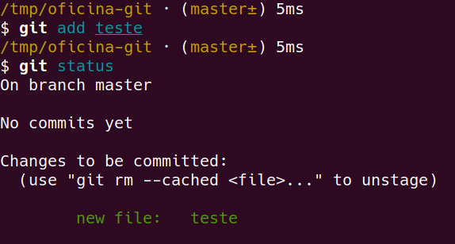

# Oficina de Git

Nessa oficina assumimos que o git já está instalado. Se não for o caso, consulte as referências para descobrir como instalar para o seu sistema.

## O que é git?

`git` é uma ferramenta de controle de versão. Tá, mas o que é controle de versão?

Pense na seguinte situação: você está trabalhando em um texto, editando, editando, apaga um pedaço, edita mais. Depois de um tempo você pensa: putz, aquele pedaço que eu apaguei tinha um trecho que eu queria pegar de volta pra usar agora. Como você faz? Aperta ctrl+z até recuperar o que apagou e torce pra não perder todo o trabalho que você fez por acidente? E se você tiver fechado o editor e não der mais pra usar o ctrl+z, já era?

Ferramentas de controle de versão permitem que você "salve" o seu trabalho várias vezes ao longo do caminho. Isso permite que você veja progresso, veja histórico e recupere qualquer ponto no passado do projeto a qualquer momento. No exemplo do texto, se você estivesse usando `git`, teria vários `commits` ao longo do caminho e poderia olhar o commit que tinha o texto que você apagou sem se preocupar em perder seu trabalho.

## Comandos básicos

Pra começar a trabalhar com git, você precisa de um `repositório`. Um repositório é uma pasta que o `git` vai monitorar para poder reconhecer alterações.

### git init

Para usar o git em uma pasta e tratá-la como repositório, use o comando `git init`:

```
cd ~/oficina-git
git init
```

Uma mensagem aparecerá:

> Initialized empty Git repository in /tmp/oficina-git/.git/

### git add e git status

Se eu edito um arquivo ele automaticamente entra pro git? Não, você precisa pedir para _trackear_ este arquivo, ou seja, adicionar ele ao git. E como eu sei se um arquivo está no git ou não? Use o comando `git status`:


Nesse exemplo existe um arquivo chamado `teste`, com o nome em vermelho no print, que o git não conhece. Veja que ele aparece na seção _Untracked files_, ou seja, arquivos não trackeados.

Para adicionar, use o comando `git add`:



A partir daqui o git vai saber que o arquivo `teste` existe e caso você faça novas alterações ele vai mostrar no `git status` que o arquivo tá modificado.

### git commit

Então blz, adicionei o arquivo `teste` e ele agora está salvo naquele histórico, né? Ainda não.

Pra isso, precisamos usar o `git commit`. O comando commit é o que realmente grava uma versão. O `git add` basicamente diz ao git: acompanha esse arquivo aqui, pega essas mudanças que eu fiz nele. O que o commit faz é um ctrl+s, ou seja, ele salva a versão atual.

```
git commit -m "Commitar arquivo teste"
```

Aqui, se você rodar o `git status` ele vai dizer que está tudo limpo e não há nada modificado no seu repositório.

### git log

Para ver o commit que você fez, use o git log:


Conforme você for avançando no projeto e fazendo novos commits o `git log` vai ficando mais longo e vai mostrando tudo que você fez no meio do caminho. Dá para entrar em qualquer commit e ver como eram os arquivos do seu repositório naquele momento no tempo.

Usar o git te permite viajar no tempo!


## Remotes

Toda essa viagem no tempo é linda, mas só está acontecendo na sua máquina até agora. E se eu quiser trabalhar nesse repositório junto com outra pessoa, como eu faço? Crio um arquivo .zip e mando pra ela por email? E se depois disso nós duas fizermos alterações, como que a gente junta o que todo mundo fez?

Felizmente, temos uma opção melhor: usar _remotes_. Um remote é só uma cópia do seu repositório em outra máquina. O git é capaz de reconhecer vários remotes e entender que eles estão trabalhando no mesmo repositório, o que facilita a integração entre as mudanças feitas em vários lugares diferentes.

E é aí que entra o github.

### Github

O [github](github.com) é o maior e mais famoso _remote_ de git que existe. Ele funciona como uma enorme máquina que contém remotes de vários repositórios e de várias pessoas, é como se fosse um repositório central de git.

Além disso, ele também funciona como uma rede social, facilita com que pessoas trabalhando nos mesmos repositórios compartilhem seu código e tem muitas funcionalidades além disso, como repositórios privados, organizações, controle de acesso para definir quem pode mexer no quê e muito mais.

### git e github é a mesma coisa?

`git` é a ferramenta de linha de comando. `github` é o site pra onde nós podemos enviar as nossas mudanças e compartilhá-las com o mundo.

É comum confundir os dois mas se lembre que nós começamos a usar o `git` antes de falar sobre o `github`, o `git` é uma ferramenta independente, você pode usar ele só localmente e nunca pensar no github ou pode usar outros sites concorrentes do github também, como o [bitbucket](https://bitbucket.org/) ou o [gitlab](https://gitlab.com).

### git clone

Para trabalhar localmente com um repositório remoto, precisamos usar o comando `git clone`. O git clone faz download de um repositório git que está em outro lugar e copia ele para a sua máquina. Por exemplo, para clonar esta oficina aqui, rode:

```
git clone https://github.com/vdemario/oficina-git.git
```

O repositório `github.com/vdemario/oficina-git` é público, então você pode fazer uma cópia dele à vontade, inclusive se você não tiver uma conta no github.

### git push

Ok, fiz várias alterações no meu código, commitei várias vezes, tenho todo um histórico bonitinho do meu trabalho. Agora eu quero mandar isso pro github pra poder pegar o código em outra máquina e continuar trabalhando. Ou eu quero mandar para o github pra poder mostrar pra outra pessoa o que eu fiz e trabalharmos juntos. O comando que você precisa usar para isso é o `git push`.

```
$ git push
Counting objects: 3, done.
Delta compression using up to 8 threads.
Compressing objects: 100% (3/3), done.
Writing objects: 100% (3/3), 825 bytes | 825.00 KiB/s, done.
Total 3 (delta 1), reused 0 (delta 0)
remote: Resolving deltas: 100% (1/1), completed with 1 local object.
To https://github.com/vdemario/oficina-git.git
   cba46b1..45b0928  master -> master
```

Em geral, você não precisa se preocupar muito com os detalhes que o `git push` te dá, mas é importante ler principalmente o final do texto pra saber se deu tudo certo ou se um erro aconteceu. Nesse exemplo, repare na frase _completed with 1 local object_. Isso significa que o `git push` completou e conseguiu enviar dados para o repositório remoto, ou seja, para o github.

Na primeira vez que você quiser fazer push para o github, você precisa configurar a conexão entre o seu `git` local e a sua conta no `github`, para o github saber que o push que ele está recebendo vem da pessoa certa. Existem muitas formas de fazer isso que estão bem documentadas no [GitHub Help](https://help.github.com/en/github/getting-started-with-github/set-up-git#next-steps-authenticating-with-github-from-git).

### git pull

O `git pull` é o inverso do `git push`. Quando existem novas alterações no remote/github você pode usar o `git pull` pra baixar essas alterações para o seu repositório local. Isso é muito útil quando você trabalha em várias máquinas ou para quando várias pessoas trabalham no mesmo repositório.

## Branches

### git branch

### git checkout

## Outras partes interessantes

### .gitignore

### git config

### Commit early, commit often

## Referências e como se aprofundar

- [LMS](https://lms.laboratoria.la/cohorts/spl-2020-03-bc-core-sap004/courses/scm-pt)
- [Livro Pro Git](https://git-scm.com/book/en/v2)
- [Learn Git in 30 minutes](https://tutorialzine.com/2016/06/learn-git-in-30-minutes)
